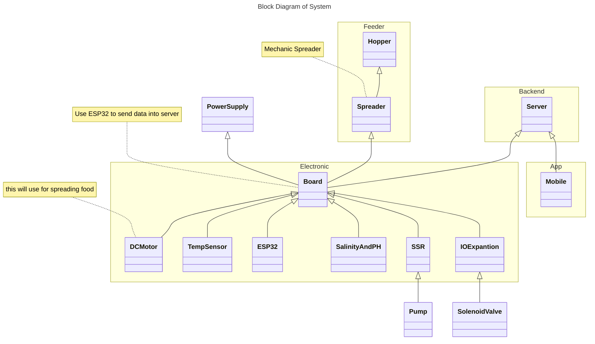

  
  
  
  

    
   Automated Fish Cultivation

# 🐟 IWAKI - Automated Fish Cultivation

Initial System Design 

## 🌳 Logs
- create initial system design, 23 november 2024 at ⏰ 14:26

## 🎈 Reference 

- [A Guide to Recirculation Aquaculture](https://openknowledge.fao.org/server/api/core/bitstreams/a0297773-095a-4ae7-9a89-5a3bfb48abc7/content)
- [a freecad manual](https://www.freecad.org/manual/a-freecad-manual.pdf)
